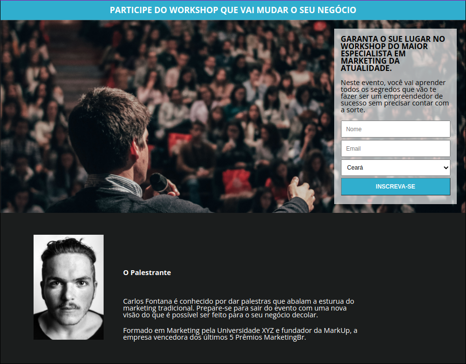

# CapturePageByProgramadorBr
### Pedro Henrique  Desenvolvedor Web Full Stack  

## Descrição
Este repositório contém uma página de captura proposta no curso de Desenvolvedor Full Stack. Os assuntos estudados no curso para obter o resultado dessa página foram: 
* HTML Básico: estrutura básica, conceito de tag, títulos, parágrafos, formatação, listas, tabelas, etc.
* CSS Básico: tipos de CSS (inline, interno e externo), classes e IDs, cores, div, background, margin, padding, box model, etc.
* CSS Intermediário: display, positions, alinhamentos, float, viewport, responsividade, media querys, etc.
* HTML Intermediário: formulários, tipos de inputs, tags semânticas e novos inputs do HTML 5, etc.  

## Estrutura do repositório
Para diferenciar o código que fiz com o que aprendi e as minhas pesquisas, o repositório contará com duas pastas:
* ByMe - Contém os arquivos feitos por mim com meu aprendizado.
* MyProgBr - Contém o código feito pelo professor do curso.

O objetivo de separar o repositórop em duas partes é mostrar as diferenças entre meu código, que eu mesmo fiz, com o código do professor.